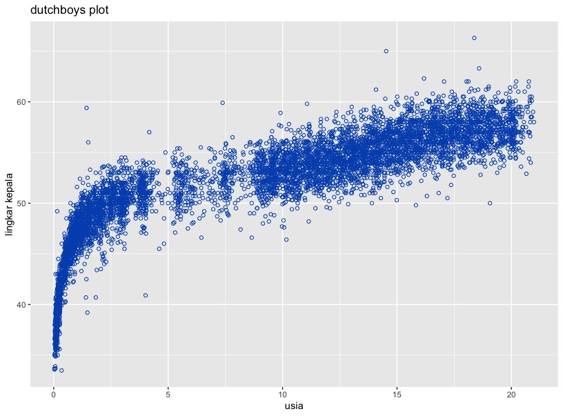
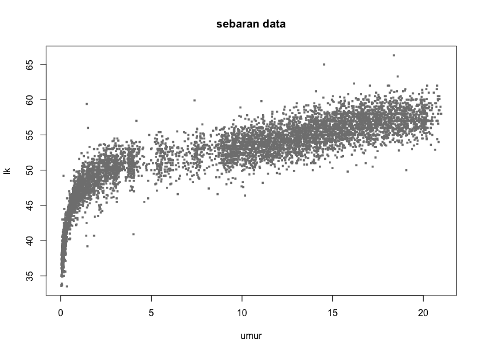
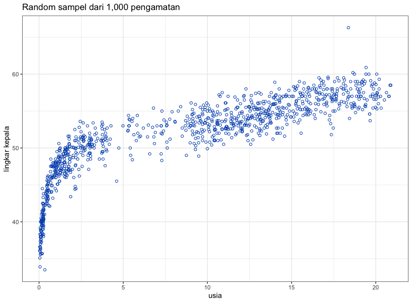
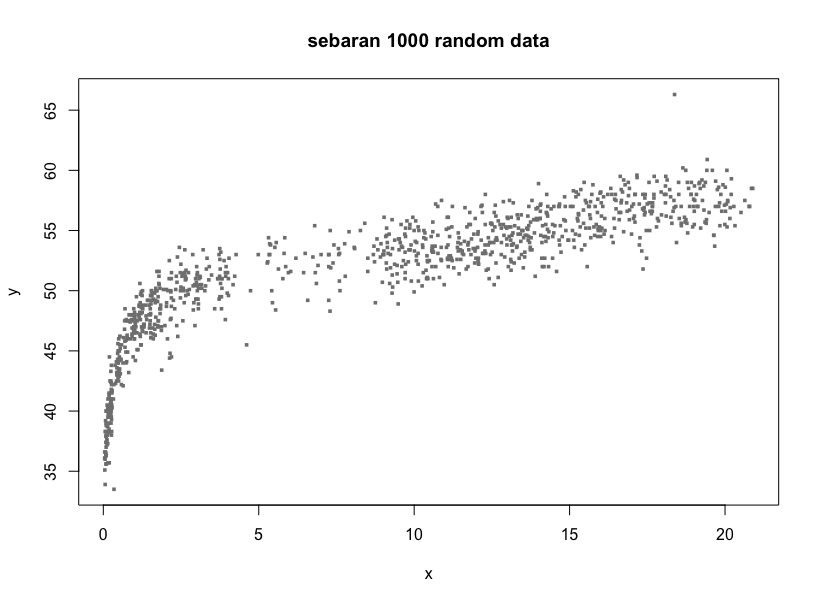

<em>Centile estimation</em> mencakup metode untuk memprediksi pertumbuhan manusia terhadap usia. Estimasi standar kurva <em>centile</em> terdiri dua variabel:
1. Variabel respon, yaitu variabel yang akan dicari kurva sentilnya, contohnya berat badan, BMI, lingkar kepala dll.
2. Variabel penjelas, misalnya usia.

Berikut adalah tutorial estimasi percentil dan pembuatan kurva pertumbuhan menggunakan R dan R Studio. 

NOTE: Kalian harus install [R](https://cloud.r-project.org) dan [R studio](https://posit.co/download/rstudio-desktop/) terlebih dahulu.


Langkah pertama adalah memasukan library yang diperlukan dengan memasukan kode berukut di console R studio.
```R
library(repmis)
library(ggplot2)
library(gamlss)
library(tidyverse)
```
gunakan fungsi source_data() untuk mendownload data yang akan digunakan dengan mengetikkan perintah berikut:
```R
source_data("https://github.com/cran/expectreg/blob/master/data/dutchboys.rda?raw=True")
``` 
gunakan fungsi dim() untuk menampilkan dimensi data
```R
dim(dutchboys)
```
Pastikan muncul output berikut:
```R 
[1] 6848 10 # terdapat 6848 data point dan 10 kolom
```
gunakan fungsi <em>names()</em> untuk menampilkan nama-nama kolom pada dataset:
```R 
names(dutchboys)
```
Pastikan output berikut muncul:
```R
[1] "defnr" "age"   "hgt"   "wgt"   "hc"    "hgt.z" "wgt.z" "hc.z"  "bmi.z" 
[10] "hfw.z"
```
Untuk melihat pola sebaran data, kita dapat membuat plot menggunakan bantuan library ggplot2 yang telah kita masukkan sebelumnya. Berikut adalah fungsi ggplot2 untuk memploting dataset:
```R
ggplot(dutchboys, aes(x=age, y=hc)) +
  geom_point(shape = 1, color = "#0052bb", size = 1.5) + 
  ggtitle("The Dutch boys data") +
  xlab("age") + ylab("head circumference") +
  theme_bw()
```
Pastikan hasil plotting seperti gambar berikut:

<figure>

<figcaption>Hasil plotting dataset menggunakan ggplot2</figcaption>
</figure>


atau dapat juga menggunakan fungsi R berikut:
```R
plot(hc~age, data=dutchboys, pch=15, cex=0.5, col=gray(0.5), xlab='x', ylab='y') + title('sebaran 6848 data')
```
output:

<figure>

<figcaption>Hasil plotting menggunakan fungsi plot R</figcaption>
</figure>

Plot di atas dapat disederhanakan dengan perintah berikut:
```R
set.seed(080320)
IND<-sample.int(dim(dutchboys)[1],1000, replace=FALSE)
dutchboys1<-dutchboys[IND,]
ggplot(dutchboys1, aes(x=age, y=hc)) +
  geom_point(shape = 1, color = "#0052bb", size = 1.5) + 
  ggtitle("Random sample of 1,000 observations") +
  xlab("age") + ylab("head circumference") +
  theme_bw()
```
Output:

<figure>

<figcaption>Hasil plotting 1000 sampel menggunakan ggplot2</figcaption>
</figure>

atau dengan fungsi plot R berikut:
```R
set.seed(080320)
IND<-sample.int(dim(dutchboys)[1],1000, replace=FALSE)
dutchboys1 <- dutchboys[IND,]
plot(hc~age, data=dutchboys1, pch = 15, cex = 0.5, col = gray(0.5), xlab='x', ylab='y')
title("sebaran 1000 random data")
```
output:

<figure>

<figcaption>Hasil plotting 1000 samppel menggunakan fungsi R</figcaption>  
</figure>

Berikut adalah perintah untuk membuat kurva pertumbuhan menggunakan fungsi lms:
```R
m0 <- lms(hc, age, families=c("BCCGo", "BCPEo", "BCTo"), data=dutchboys, k=3, calibration=F, trans.x=T)
```
Keterangan:
```
m0          :model
hc          :variabel respon(Y)
age         :variabel penjelas (x)
families    :families=c("BCCGo", "BCPEo", "BCTo")
data        :nama dataframe yang dianalisis
k           :penalty yang digunakan dalam GAIC, default k=2;
calibration :jika diperlukan = TRUE, sebaliknya = FALSE
trans.x     :Jika diperlukan transformasi x -> xξ, default x=FALSE;
```
Proses fitting membutuhkan waktu tergantung kecepatan komputer yang digunakan:
```
*** Checking for transformation for x *** 
*** power parameters  0.3805277 ***  
*** Initial  fit***  
GAMLSS-RS iteration 1: Global Deviance = 26367.98 
GAMLSS-RS iteration 2: Global Deviance = 26367.98 
*** Fitting BCCGo *** 
GAMLSS-RS iteration 1: Global Deviance = 26425.3 
GAMLSS-RS iteration 2: Global Deviance = 26284.07 
GAMLSS-RS iteration 3: Global Deviance = 26282.6 
GAMLSS-RS iteration 4: Global Deviance = 26282.61 
GAMLSS-RS iteration 5: Global Deviance = 26282.61 
*** Fitting BCPEo *** 
GAMLSS-RS iteration 1: Global Deviance = 26660.28 
GAMLSS-RS iteration 2: Global Deviance = 26110.56 
GAMLSS-RS iteration 3: Global Deviance = 26107.54 
GAMLSS-RS iteration 4: Global Deviance = 26107.57 
GAMLSS-RS iteration 5: Global Deviance = 26107.56 
*** Fitting BCTo *** 
GAMLSS-RS iteration 1: Global Deviance = 26185.76 
GAMLSS-RS iteration 2: Global Deviance = 26021.22 
GAMLSS-RS iteration 3: Global Deviance = 26020.8 
GAMLSS-RS iteration 4: Global Deviance = 26021.14 
GAMLSS-RS iteration 5: Global Deviance = 26021.39 
GAMLSS-RS iteration 6: Global Deviance = 26021.51 
GAMLSS-RS iteration 7: Global Deviance = 26021.58 
GAMLSS-RS iteration 8: Global Deviance = 26021.61 
GAMLSS-RS iteration 9: Global Deviance = 26021.62 
GAMLSS-RS iteration 10: Global Deviance = 26021.63 
GAMLSS-RS iteration 11: Global Deviance = 26021.63 
GAMLSS-RS iteration 12: Global Deviance = 26021.63 
GAMLSS-RS iteration 13: Global Deviance = 26021.63 
% of cases below  0.4 centile is  0.4088785 
% of cases below  2 centile is  1.796145 
% of cases below  10 centile is  9.886098 
% of cases below  25 centile is  25.70093 
% of cases below  50 centile is  50.05841 
% of cases below  75 centile is  74.41589 
% of cases below  90 centile is  90.02629 
% of cases below  98 centile is  98.23306 
% of cases below  99.6 centile is  99.70794 

PENTING:
power of transformation : 0.3805277
ditribusi paling baik   : BCTo (GAIC k=3)
```
Output kurva percentile:

<figure>

<figcaption>Output kurva percentile dengan metode lms</figcaption>
</figure>

Berdasarkan output di atas, mengacu pada GAIC(3) adalah BCTo.
Distribusi terbaik, berdasarkan GAIC(κ=2), menggunakan`m0$family`adalah BCCGo. Model `m0` dapat difit secara langsung dengan perintah berikut:

```R 
dutchboys$Tage<-(dutchboys$age)^(m0$power)
m1<-gamlss(hc~pb(Tage), sigma.formula=~pb(Tage),
            nu.formula=~pb(Tage), tau.fo=~pb(Tage), family=BCTo,
            trace=FALSE, data=dutchboys)
```
Aalternatif lain untuk memplot `m0`
```R
m2<-gamlss(hc~pb(age^m0$power), sigma.formula=~pb(age^m0$power),
           nu.formula=~pb(age^m0$power), tau.fo=~pb(age^m0$power),
           family=BCTo, data=dutchboys,
           trace=FALSE)
```
Degrees of freedom efektif yang digunakan untuk smooth functions dalam model `m0` adalah sebagai berikut:
```R
edfAll(m0)
```
output
```
$mu
$mu$`pb(x, df = mu.df)`
[1] 13.40125


$sigma
$sigma$`pb(x, df = sigma.df)`
[1] 5.645407


$nu
$nu$`pb(x, df = nu.df)`
[1] 2.911063


$tau
$tau$`pb(x, df = tau.df)`
[1] 2.000227
```
Jadi dfμ = 13.4, dfσ = 5.6, dfν = 2.0.
Dapat juga diakses dengan perintah berikut:
```R
m0$mu.df; m0$sigma.df; m0$nu.df
```
#### Estimasi smoothing parameters
Kita harus memilih nilai dfμ, dfσ, dfυ, dfτ, dan ϵ dengan cara:

* melalui trial and error
* meminimalisir generalized Akaike information criterion, GAIC(#)
* meminimalisir validation global deviance VGD
* menggunakan kriteria local selection, i.e. CV, ML
PENTING: Diagnosis harus dilakukan dengan semua cara di atas.

```R
dutchboys$Tage<-(dutchboys$age)^(m0$power)
m3<-gamlss(hc~pb(Tage, method="GAIC", k=3),
           sigma.formula=~pb(Tage, method="GAIC", k=3),
           nu.formula=~pb(Tage, method="GAIC", k=3),
           tau.formula = ~pb(Tage, method="GAIC", k=3),
           family=BCT,data=dutchboys, trace=FALSE)
edfAll(m3)
````
Output
```
## $mu
## $mu$`pb(Tage, method = "GAIC", k = 3)`
## [1] 11.44023
## 
## 
## $sigma
## $sigma$`pb(Tage, method = "GAIC", k = 3)`
## [1] 2.013972
## 
## 
## $nu
## $nu$`pb(Tage, method = "GAIC", k = 3)`
## [1] 2.595608
## 
## 
## $tau
## $tau$`pb(Tage, method = "GAIC", k = 3)`
## [1] 2.039529
```
Dapat juga menggunakan fungsi find.hyper() gamlss:

```R
mod<-quote(gamlss(hc~cs(Tage,df=p[1]), sigma.formula=~cs(Tage,df=p[2]),
                  nu.formula=~cs(Tage,df=p[3], c.spar=c(-1.5,2.5)),
                  tau.formula=~Tage, data=dutchboys, family=BCT,
                  control=gamlss.control(trace=FALSE)))
```
```R
op<-find.hyper(model=mod, other=quote(Tage<-age^p[4]),
               par=c(10,4,1,0.25),lower=c(0.1,0.1,0.1,0.001),
               steps=c(0.1,0.1,0.1,0.2),factr=2e9,parscale=c(1,1,1,0.035),
               k=3)
```
output:
```
## par 10 4 1 0.25 crit= 26092.45 with pen= 3 
## par 10.1 4 1 0.25 crit= 26092.46 with pen= 3 
## par 9.9 4 1 0.25 crit= 26092.45 with pen= 3 
## par 10 4.1 1 0.25 crit= 26092.4 with pen= 3 
## par 10 3.9 1 0.25 crit= 26092.5 with pen= 3 
## par 10 4 1.1 0.25 crit= 26092.57 with pen= 3 
## par 10 4 0.9 0.25 crit= 26092.35 with pen= 3 
## par 10 4 1 0.257 crit= 26092.45 with pen= 3 
## par 10 4 1 0.243 crit= 26092.45 with pen= 3 
## par 9.962885 4.5036 0.1368609 0.25 crit= 26092.25 with pen= 3 
## par 10.06288 4.5036 0.1368609 0.25 crit= 26092.25 with pen= 3 
## par 9.862885 4.5036 0.1368609 0.25 crit= 26092.25 with pen= 3 
## par 9.962885 4.6036 0.1368609 0.25 crit= 26092.22 with pen= 3 
## par 9.962885 4.4036 0.1368609 0.25 crit= 26092.27 with pen= 3 
## par 9.962885 4.5036 0.2368609 0.25 crit= 26092.14 with pen= 3 
## par 9.962885 4.5036 0.1 0.25 crit= 26092.3 with pen= 3 
## par 9.962885 4.5036 0.1368609 0.257 crit= 26092.25 with pen= 3 
## par 9.962885 4.5036 0.1368609 0.243 crit= 26092.25 with pen= 3 
## par 9.971324 4.472681 0.5274981 0.25 crit= 26092 with pen= 3 
## par 10.07132 4.472681 0.5274981 0.25 crit= 26092.01 with pen= 3 
## par 9.871324 4.472681 0.5274981 0.25 crit= 26092.01 with pen= 3 
## par 9.971324 4.572681 0.5274981 0.25 crit= 26091.98 with pen= 3 
## par 9.971324 4.372681 0.5274981 0.25 crit= 26092.04 with pen= 3 
## par 9.971324 4.472681 0.6274981 0.25 crit= 26092.01 with pen= 3 
## par 9.971324 4.472681 0.4274981 0.25 crit= 26092.03 with pen= 3 
## par 9.971324 4.472681 0.5274981 0.257 crit= 26092 with pen= 3 
## par 9.971324 4.472681 0.5274981 0.243 crit= 26092 with pen= 3 
## par 9.966412 4.623534 0.5604418 0.25 crit= 26091.97 with pen= 3 
## par 10.06641 4.623534 0.5604418 0.25 crit= 26091.97 with pen= 3 
## par 9.866412 4.623534 0.5604418 0.25 crit= 26091.97 with pen= 3 
## par 9.966412 4.723534 0.5604418 0.25 crit= 26091.95 with pen= 3 
## par 9.966412 4.523534 0.5604418 0.25 crit= 26091.99 with pen= 3 
## par 9.966412 4.623534 0.6604418 0.25 crit= 26091.98 with pen= 3 
## par 9.966412 4.623534 0.4604418 0.25 crit= 26091.98 with pen= 3 
## par 9.966412 4.623534 0.5604418 0.257 crit= 26091.97 with pen= 3 
## par 9.966412 4.623534 0.5604418 0.243 crit= 26091.97 with pen= 3 
## par 9.969574 5.005125 0.5626791 0.25 crit= 26091.92 with pen= 3 
## par 10.06957 5.005125 0.5626791 0.25 crit= 26091.93 with pen= 3 
## par 9.869574 5.005125 0.5626791 0.25 crit= 26091.93 with pen= 3 
## par 9.969574 5.105125 0.5626791 0.25 crit= 26091.92 with pen= 3 
## par 9.969574 4.905125 0.5626791 0.25 crit= 26091.93 with pen= 3 
## par 9.969574 5.005125 0.6626791 0.25 crit= 26091.94 with pen= 3 
## par 9.969574 5.005125 0.4626791 0.25 crit= 26091.93 with pen= 3 
## par 9.969574 5.005125 0.5626791 0.257 crit= 26091.92 with pen= 3 
## par 9.969574 5.005125 0.5626791 0.243 crit= 26091.92 with pen= 3 
## par 9.960439 5.067937 0.5571777 0.25 crit= 26091.92 with pen= 3 
## par 10.06044 5.067937 0.5571777 0.25 crit= 26091.92 with pen= 3 
## par 9.860439 5.067937 0.5571777 0.25 crit= 26091.92 with pen= 3 
## par 9.960439 5.167937 0.5571777 0.25 crit= 26091.92 with pen= 3 
## par 9.960439 4.967937 0.5571777 0.25 crit= 26091.92 with pen= 3 
## par 9.960439 5.067937 0.6571777 0.25 crit= 26091.93 with pen= 3 
## par 9.960439 5.067937 0.4571777 0.25 crit= 26091.93 with pen= 3 
## par 9.960439 5.067937 0.5571777 0.257 crit= 26091.92 with pen= 3 
## par 9.960439 5.067937 0.5571777 0.243 crit= 26091.92 with pen= 3
```
```R
Tage<-(dutchboys$age)^(op$par[4])
m4<-gamlss(hc~cs(Tage,df=op$par[1]), 
            sigma.formula=~cs(Tage,df=op$par[2]),
            nu.formula=~cs(Tage,df=op$par[3],c.spar=c(-1.5,2.5)),
            family=BCT, data=dutchboys)
```
output:
```
## GAMLSS-RS iteration 1: Global Deviance = 26198.73 
## GAMLSS-RS iteration 2: Global Deviance = 26041.95 
## GAMLSS-RS iteration 3: Global Deviance = 26041.66 
## GAMLSS-RS iteration 4: Global Deviance = 26041.72 
## GAMLSS-RS iteration 5: Global Deviance = 26041.73 
## GAMLSS-RS iteration 6: Global Deviance = 26041.73 
## GAMLSS-RS iteration 7: Global Deviance = 26041.73
```
Selanjutnya bandingkan semua model:
```R
GAIC(m0, m1, m2, m3, m4, k=3)
```
#### Diagnosis Residual menggunakan q statistics dan worm plots
Pemeriksaan model m0 sangat penting untuk pembentukan kurva. Q statistics dan worm plots:
1. Q statistics
```R 
qstats<-Q.stats(m0, xvar = dutchboys$age, n.inter = 9)
```
2. Worm plot 
```R
wp(m0, xvar=dutchboys$age, n.inter=9)
```
#### Plotting Kurva Centile Pertumbuhan
```R
centiles(m0)
```

References
~ Stasinopoulos, M. D., Rigby, R. A., Heller, G. Z., Voudouris, V.,, Bastiani, F. D. (2017). Flexible regression and smoothing : using GAMLSS in R. Chapman and Hall/CRC . ISBN: 9781138197909 1138197904 
